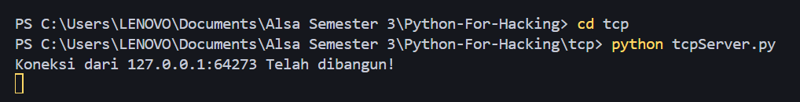
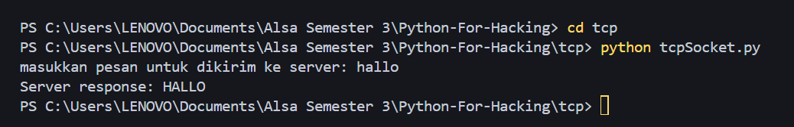
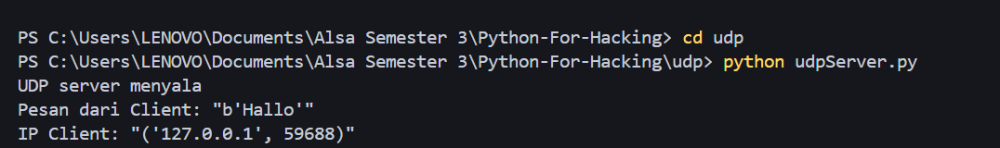
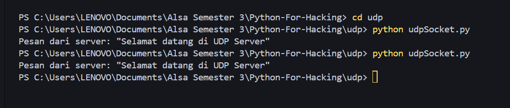

# Python-for-Hacking
# 💻 Python Network Socket Examples (TCP & UDP)

Ini adalah koleksi contoh dasar untuk membuat koneksi jaringan menggunakan modul **socket** Python, mencakup implementasi klien-server untuk protokol **TCP** (Transmission Control Protocol) dan **UDP** (User Datagram Protocol).

---

## ✨ Fitur Utama

* **TCP Client-Server:** Menunjukkan koneksi yang andal, berorientasi koneksi, dan mekanisme *echo* di mana server membalas pesan klien.
* **UDP Client-Server:** Menunjukkan komunikasi tanpa koneksi *datagram* untuk pertukaran pesan cepat.
* **Contoh Sederhana:** Kode yang mudah dipahami dan dimodifikasi untuk eksperimen jaringan dasar.

---

## 🚀 Cara Menjalankan

Proyek ini memerlukan **Python 3**.

### 1. Struktur Direktori

Pastikan Anda memiliki file-file berikut di dalam direktori yang sesuai:

| Direktori | File | Deskripsi |
| :--- | :--- | :--- |
| `tcp` | [`tcpServer.py`](./tcp/tcpServer.py) | Berfungsi sebagai server *Echo* berbasis TCP. Server di-*bind* ke alamat *localhost* (`127.0.0.1`) dan *port* `12345`, dan *listening* untuk koneksi masuk. Setelah koneksi *client* diterima, server akan **menerima pesan**, **mengonversinya menjadi huruf kapital (uppercase)**, dan **mengirimkannya kembali** ke klien sebelum menutup koneksi spesifik tersebut. Implementasi ini bersifat *blocking* per koneksi. |
| `tcp` | [`tcpSocket.py`](./tcp/tcpSocket.py) | Berfungsi sebagai klien TCP. Script membuat koneksi ke server pada *port* `12345`. Klien meminta *input* string dari pengguna melalui konsol (`input()`), mengirimkannya ke server, dan kemudian **mencetak balasan** yang diterima dari server (pesan dalam format *uppercase*) ke layar. |
| `udp` | [`udpServer.py`](./udp/udpServer.py) | Berfungsi sebagai server UDP tanpa koneksi (*connectionless*). Server di-*bind* ke *port* `9997` dan berjalan dalam *loop* tak terbatas (`while True`) untuk mendengarkan *datagram* yang masuk. Ketika datagram diterima, server **mencetak isi pesan** serta **alamat IP dan port sumber** klien. Server kemudian mengirimkan **balasan statis** (`b"Selamat datang di UDP Server"`) kembali ke alamat sumber tersebut. |
| `udp` | [`udpSocket.py`](./udp/udpSocket.py) | Berfungsi sebagai klien UDP. Script membuat *socket* UDP, kemudian segera **mengirimkan *datagram* statis** (`b"Hallo"`) ke alamat target `127.0.0.1:9997`. Setelah pengiriman, klien menunggu dan **mencetak balasan** dari server. |

### 2. Menjalankan TCP

Untuk melihat komunikasi TCP, Anda **harus menjalankan server terlebih dahulu**, kemudian klien.

1.  **Jalankan Server TCP:**
    ```bash
    cd tcp
    python tcpServer.py
    ```
    Output
    
    
3.  **Jalankan Klien TCP (di terminal baru):**
    ```bash
    cd tcp
    python tcpSocket.py
    ```
    Output
    

### 3. Menjalankan UDP

Komunikasi UDP juga memerlukan server dan klien, tetapi tidak memerlukan urutan koneksi formal.

1.  **Jalankan Server UDP:**
    ```bash
    cd udp
    python udpServer.py
    ```
    Output
    
    
2.  **Jalankan Klien UDP (di terminal baru):**
    ```bash
    cd udp
    python udpSocket.py
    ```
    Output
    

---

## 📖 Perbandingan TCP vs. UDP

Proyek ini menunjukkan perbedaan mendasar antara kedua protokol:

| Fitur | TCP (Transmission Control Protocol) | UDP (User Datagram Protocol) |
| :--- | :--- | :--- |
| **Keandalan** | Tinggi (Terjamin pengiriman) | Rendah (Tidak ada jaminan pengiriman) |
| **Orientasi** | Berorientasi Koneksi (Perlu *handshake* 3-arah) | Tanpa Koneksi (*Datagram*) |
| **Kecepatan** | Lebih Lambat | Lebih Cepat |
| **Penggunaan** | *Web Browsing* (HTTP), Transfer File (FTP) | *Streaming* Video/Audio, Permainan Daring, DNS |

---

## 🤝 Kontribusi

Selamat datang kontribusi, laporan *bug*, dan saran perbaikan. Silakan buka *issue* atau kirim *pull request*.
